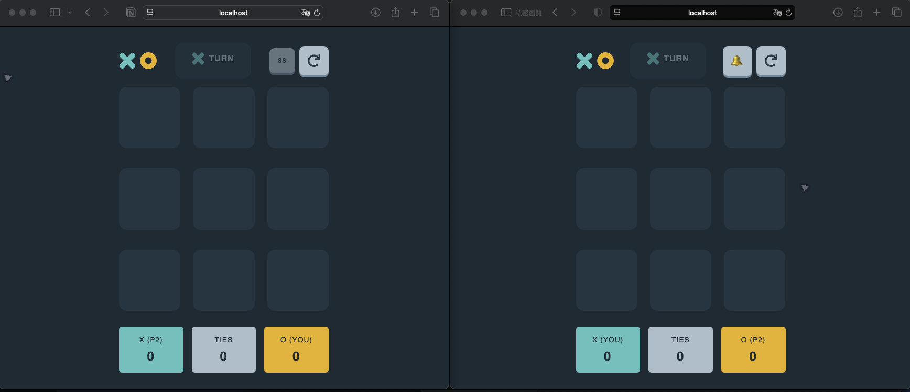
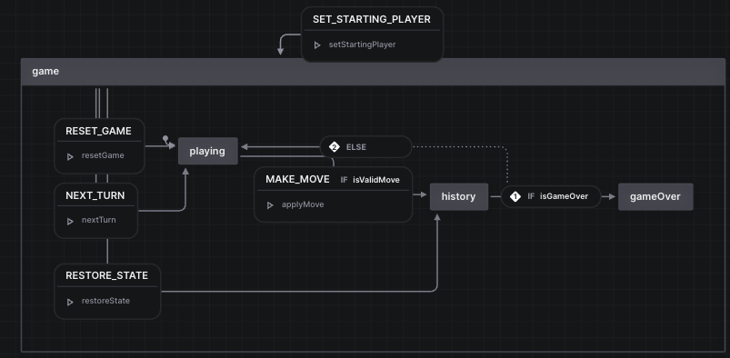

# Frontend Mentor - Tic Tac Toe solution

This is a solution to the [Tic Tac Toe challenge on Frontend Mentor](https://www.frontendmentor.io/challenges/tic-tac-toe-game-Re7ZF_E2v). Frontend Mentor challenges help you improve your coding skills by building realistic projects.

## Table of contents

- [Overview](#overview)
  - [The challenge](#the-challenge)
  - [Features](#features)
  - [Screenshot](#screenshot)
  - [Links](#links)
- [My process](#my-process)
  - [Built with](#built-with)
  - [Getting started](#getting-started)
  - [State Management](#state-management)
  - [AI Collaboration](#ai-collaboration)
  - [What I learned](#what-i-learned)
  - [Continued development](#continued-development)
  - [Useful resources](#useful-resources)
- [Author](#author)
- [Acknowledgments](#acknowledgments)

## Overview

### The challenge

Users should be able to:

- View the optimal layout for the game depending on their device's screen size
- See hover states for all interactive elements on the page
- Play the game either solo vs the computer or multiplayer against another person
- **Bonus 1**: Save the game state in the browser so that it’s preserved if the player refreshes their browser
- **Bonus 2**: Instead of having the computer randomly make their moves, try making it clever so it’s proactive in blocking your moves and trying to win

### Features

To make the project more interesting, I've added a few extra features:

- **Single-player mode with Bot:** Implemented using the [Minimax algorithm](./src/app/utils/bot.ts#L26)
- **Multiplayer mode:** Real-time competition powered by [Colyseus](https://colyseus.io/).

### Screenshot



### Links

- Solution URL: [https://github.com/Chious/fm-tic-tac-toe](https://github.com/Chious/fm-tic-tac-toe)
- Live Site URL: The project consists of two parts: client and server. They can be deployed using Docker-friendly services like [Virtual Machine](https://aws.amazon.com/ec2/) or [Render](https://render.com/). In this project, they are deployed separately on [Zeabur](https://zeabur.com/):
  - **Client:** [https://fm-tic-tac-toe.zeabur.app](https://fm-tic-tac-toe.zeabur.app)
  - **Server:** [https://fm-tic-tac-toe-server.zeabur.app](https://fm-tic-tac-toe-server.zeabur.app)
    - `/`: Enabled playground for debugging and monitoring the server status during development.
    - `/monitor`: For monitoring the server status; protected by basic auth (default password is set in the `process.env.MONITOR_PASSWORD`).

## My process

### Built with

- Angular
- Tailwind CSS
- Colyseus (Multiplayer Server)
- Docker & Docker Compose

### Getting started

To get the project running locally, first copy the `.env.example` file to `.env` to share the server domain and port with the client:

```bash
cp .env.example .env
```

This project uses Docker Compose to set up both the client and the server. Simply run:

```bash
docker compose up -d
```

#### Without Docker

```bash
# **important** Server: 2567 port
cd server
npm install
npm start

# Client: 4200 port
npm install
npm start
```

### State Management

#### Single player mode (Client side)

When gameplay logic becomes complex, it helps to use XState to draw state diagrams. However, it's also worth noting that using [signals](https://angular.dev/guide/signals) can be very suitable for modern Angular web development.



#### Multiplayer mode (Server State)

For multiplayer mode, the server handles the state and synchronizes it with the client via WebSockets. Check out the API details here: [server/SERVER_API.md](./server/SERVER_API.md).

### AI Collaboration

Here is how I used AI tools (Cursor, Antigravity) during this project:

- **Setup & Documentation:** Used AI to help set up the design system with [design tokens](https://www.figma.com/community/plugin/888356646278934516/design-tokens) exported from Figma to Tailwind v4 (in `style.css`). AI also assisted in generating documentation for state management and API endpoints.

- **Workflow:** For core parts like `routes`, plain HTML components, and setting up services, I wrote the code from scratch. I first studied documentation—such as learning the [Minimax Algorithm](https://ithelp.ithome.com.tw/articles/10353229)—and let the AI finish the boilerplate. This approach strengthened my memory of the concepts without needing to manually code line by line.

Here's an example of an interface and component shell I would conceptualize:

`card.component.ts`

```html
<div class="card">
  <header class="dialog-header"></header>
  <ng-content />
  <footer class="dialog-footer"></footer>
</div>
```

`game-service.ts`

```ts
const BOARD = Mark[][]

export class GameService {
   readonly gameState = signal(...)
   readonly playerState = signal(...)

   getUserState(){}
   getGameState(){}
   makeMove(){}
}
```

#### Challenges encountered with AI:

- **Complex Logic & Edge Cases:** When the logic became complex (e.g., handling user disconnections, redesigning server state, providing proper UI hints, or managing async side effects on the frontend), the AI didn't do so well. I found it necessary to think through the edge cases myself and decide on the best user experience.
- **Outdated Packages:** While setting up Colyseus, the AI fell into an infinite loop trying to use the deprecated `colyseus.js` package. Instead, I used `npm create colyseus-app@latest ./server` based on the official documentation, and manually edited the files step-by-step before integrating with the Angular client.
- **Testing Constraints:** Writing E2E or Unit tests with AI still requires careful review. Although AI writes code quickly, it doesn't always reflect a true double-check for edge cases or real user expectations. Relying on official documentation is still the best practice here.

### What I learned

Refining the integration of Colyseus with Angular utilizing XState and Signals state management resulted in a much cleaner strategy for maintaining local/remote state synchronization. Additionally, writing the game logic from scratch before letting the AI polish things, and thoroughly reading documentation, truly helped in understanding the Minimax algorithm and solving async side-effects logic that AI typically struggles with.

### Continued development

I want to continue focusing on writing robust tests and seamlessly handling complex state logic, especially real-time WebSocket disconnect/reconnect flows and writing flawless AI behavior in edge cases.

### Useful resources

- [Colyseus Documentation](https://colyseus.io/) - Great resource for multiplayer game development from the server.
- [XState Documentation](https://xstate.js.org/docs/) - Great resource for state management with state diagrams, it's suitable for game logic.
- [Day5 Minimax Algorithm](https://ithelp.ithome.com.tw/articles/10353229) - Informative tutorial for implementing the Minimax algorithm in board games.
- [Design Tokens](https://www.figma.com/community/plugin/888356646278934516/design-tokens) - Figma Plugin for exporting css details from design.

## Author

- Website - [sam-dev.space](https://www.sam-dev.space)
- Frontend Mentor - [@chious](https://www.frontendmentor.io/profile/chious)
